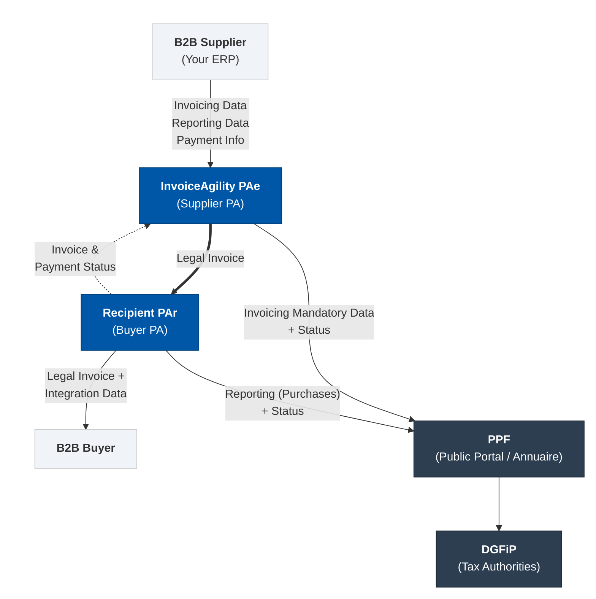

# Tungsten Automation — InvoiceAgility and the France E-Invoicing Solution

## The InvoiceAgility France Stack

- **Tungsten Automation is registered PA #0072**, officially confirmed by DGFiP — authorized to send, receive, and report e-invoices under the French mandate
- The PA runs in a **SecNumCloud-certified environment** (EU-only access); all PA functions are surfaced through Tungsten Automation's own UI
- **InvoiceAgility** handles compliant e-invoice creation, format conversion, and delivery channel selection — including Peppol connectivity — so you deal with one platform, not the underlying network complexity
- **Process Director Outbound Invoice Cockpit (OIC)**, built on Process Director, captures billing events via standard BTEs (non-invasive), enriches documents with master data, and routes them to InvoiceAgility for compliant delivery
- **44 French use cases** are supported end-to-end; 7 are available today for testing, with additional use cases rolling out through 2026
- Supported invoice formats: **Factur-X** (hybrid PDF+XML), **UBL 2.1**, and **CII** — all EN 16931 + CIUS-FR compliant

## How the Architecture Works

France operates a **Y-model** — invoices travel PA-to-PA directly. The PPF (Portail Public de Facturation) is never in the invoice path; it maintains the **Annuaire** (national directory) and relays reporting data to DGFiP.

### The Y-Model — document flows

> **Legend:** Solid lines = e-invoicing (domestic B2B) and e-reporting (cross-border B2B, B2C, international purchases). Dashed lines = invoice and payment status flows. The legal invoice travels PA-to-PA directly — the PPF is never in the invoice path.

- InvoiceAgility acts as **PAe** (sending PA) on your outbound flows and **PAr** (receiving PA) on your inbound flows — two distinct roles within the same certified PA infrastructure
- **InvoiceAgility constructs the UBL payload** from your ERP source data before handing off to the PAe for validation and transmission — format conversion happens inside InvoiceAgility- **InvoiceAgility PAe** validates against EN 16931 + CIUS-FR, queries the Annuaire for the recipient's registered PAr, and transmits PA-to-PA
- PA-to-PA exchange currently uses **Peppol BIS 3 UBL** over Peppol transport; non-Peppol PA-to-PA channels arrive Q3-2026
- Lifecycle status messages flow back through the same path into the Invoice Status Service (ISS), your InvoiceAgility portal, and your SAP cockpit

## Sending Invoices (AR / Outbound)

### Flow: your ERP → recipient PA

| Step | Component              | What happens                                                                                                                    |
| ---- | ---------------------- | ------------------------------------------------------------------------------------------------------------------------------- |
| 1    | **SAP**                | Billing document created; BTE fires                                                                                             |
| 2    | **PD OIC**             | Captures event, enriches with master data (VAT, SIRET, payment terms), applies business rules                                   |
| 3    | **InvoiceAgility**     | Converts to compliant format (Factur-X, UBL, or CII per recipient capability), selects delivery channel                         |
| 4    | **InvoiceAgility PAe** | Validates against EN 16931 + CIUS-FR, looks up recipient PAr in Annuaire, transmits PA-to-PA; sends CDAR 200 (delivered) to PPF |
| 5    | **Recipient PAr**      | Receives invoice; sends CDAR 213 (technical rejection) or CDAR 210 (business refusal) if not accepted                           |
| 6    | **PD OIC**             | Delivery statuses surface in your SAP cockpit via Invoice Status Service; CDAR 212 (paid) sent to PPF when you confirm payment  |

- Process Director OIC captures SAP billing events through standard BTEs — no custom ABAP, no invasive modifications
- InvoiceAgility handles format conversion and channel routing without manual intervention
- **Multi-order / multi-delivery invoices (Use Case 1)** — a major volume driver — are handled natively: InvoiceAgility preserves many-to-many links between a single invoice and multiple PO numbers, delivery notes, and shipment references in the compliant structured output
- All 44 French use cases covered, including self-billing, down-payment sequences, discount scenarios, and complex intermediary models

## Receiving Invoices (AP / Inbound)

### Flow: sender PA → your ERP

| Step | Component                | What happens                                                                                                 |
| ---- | ------------------------ | ------------------------------------------------------------------------------------------------------------ |
| 1    | **Sender PAe**           | Transmits invoice PA-to-PA to InvoiceAgility PAr                                                             |
| 2    | **InvoiceAgility PAr**   | Receives on your behalf, performs technical validation; sends CDAR 213 (rejected) to PPF if validation fails |
| 3    | **InvoiceAgility**       | Normalizes to your target format, applies enrichment and matching rules                                      |
| 4    | **Your ERP / AP system** | Invoice lands in your workflow — ready for PO matching, coding, approval                                     |
| 5    | **InvoiceAgility PAr**   | Sends CDAR 210 (refused) to PPF on your business refusal; CDAR 212 (paid) to PPF when you confirm payment    |

- Inbound invoices arrive in any of the three mandate formats (Factur-X, UBL, CII) — InvoiceAgility normalizes regardless of source format, so you receive a consistent payload
- Exception handling and matching logic run inside InvoiceAgility before delivery to your ERP, reducing manual touchpoints
- PAr statuses (mandatory: received, processing, accepted; optional: refused, paid) are managed automatically by the PA and visible in your InvoiceAgility portal

## Lifecycle & E-Reporting

### Lifecycle statuses (CDAR format)

| Code         | Message   | Triggered by       | Meaning                                               |
| ------------ | --------- | ------------------ | ----------------------------------------------------- |
| **CDAR 200** | Delivered | InvoiceAgility PAe | Invoice successfully transmitted to recipient PAr     |
| **CDAR 213** | Rejected  | InvoiceAgility PAr | Technical validation failure at receiving PA          |
| **CDAR 210** | Refused   | InvoiceAgility PAr | Business refusal by buyer (e.g., duplicate, wrong PO) |
| **CDAR 212** | Paid      | InvoiceAgility PAe | Payment confirmed by supplier                         |

- All CDAR messages are sent to PPF automatically — no action required on your side
- Rejection (213) and refusal (210) statuses flow back through InvoiceAgility to the Invoice Status Service (ISS) and surface in your SAP cockpit
- All lifecycle messages visible in your **InvoiceAgility portal** and pushed back to your ERP/SAP cockpit via ISS

### E-reporting (data to PPF → DGFiP)

| Flow | Scope | Method |
|------|-------|--------|
| **Flow 1** | Domestic B2B invoices | Per-invoice, not aggregated — InvoiceAgility extracts and submits automatically |
| **Flow 10** | International B2B, B2C, and payment data | Aggregated on schedule by InvoiceAgility |

- **Flow 1** fires on every domestic invoice transaction — no action required on your side
- **Flow 10** covers: cross-border B2B invoices sent/received, B2C transaction data, payment data for all invoice categories
- Payment data reporting is separate from CDAR lifecycle updates — triggered by actual payment events, not invoice status changes

## Getting Live

### Onboarding steps

- **Entity hierarchy**: set up in InvoiceAgility with your correct **SIREN/SIRET structure** before go-live — head office entity + establishment children (max 1 level deep); our PS team assists with initial configuration
- **Company registration**: each of your entities needs SIRET as company registration ID; SIREN embedded in VAT number (format: FR + 2 check digits + 9-digit SIREN)
- **e-Address registration**: supported formats include EDEN, SIREN, SIRET, UPEN, UPEM, and UPF — registered in the Annuaire for your inbound routing
- **KYC (Know Your Business)**: required for PA registration under the regulatory framework; Tungsten Automation/InvoiceAgility facilitates the process for you

### Timeline to go-live

| Milestone    | Timing           | What it means                                                                                                                 |
| ------------ | ---------------- | ----------------------------------------------------------------------------------------------------------------------------- |
| Grand Pilot  | Q1 2026          | PA infrastructure validated                                                                                                   |
| UAT / Pilot  | April–May 2026   | Your testing against the sandbox (InvoiceAgility portal LIVE/TEST toggle); **pilot = LIVE production with real transactions** |
| **Go-live**  | **Sept 1, 2026** | All businesses must receive; GE + ETI must send                                                                               |
| Full mandate | Sept 1, 2027     | SMEs and micro-enterprises must send                                                                                          |

- We strongly recommend you complete full UAT before entering pilot — pilot is not a sandbox, it processes real invoices in production
- Your InvoiceAgility portal provides a **LIVE/TEST toggle** for UAT testing against the sandbox environment

---

## Down-Payment Sequences (Use Cases 20 & 21)

Advance invoicing is one of the highest-volume patterns in French B2B — InvoiceAgility supports the full sequence end-to-end.

| Step                           | What happens                                                                                                                                | How InvoiceAgility handles it                                                                                                                                                                       |
| ------------------------------ | ------------------------------------------------------------------------------------------------------------------------------------------- | ------------------------------------------------------------------------------------------------------------------------------------------------------------------------------------- |
| Advance invoice issued (UC 20) | Supplier issues a down-payment invoice before goods/services are delivered; VAT may be due at this point depending on the collection regime | InvoiceAgility generates a compliant structured invoice with prepayment semantics; InvoiceAgility PAe validates and transmits PA-to-PA; CDAR 200 reported to PPF                      |
| Delivery / service performed   | Goods delivered or services rendered against the advance                                                                                    | No invoice event — advance invoice remains active in lifecycle                                                                                                                        |
| Final invoice issued (UC 21)   | Final invoice references the prior advance(s), offsets the prepaid amount, and shows the balance due                                        | InvoiceAgility links the final invoice to the original advance invoice reference(s); net amount, VAT adjustment, and prior document references are preserved in the structured output |
| Lifecycle closes               | Advance and final invoices are both tracked through to paid status                                                                          | ISS tracks both documents; CDAR 212 (paid) is sent to PPF for each when payment is confirmed                                                                                          |

- The link between advance and final invoices is maintained in the structured data — no manual reconciliation required on your AP side
- VAT treatment control (collection-basis vs accrual-basis) is handled in the mapping layer; InvoiceAgility does not alter your tax logic
- Reporting avoids double-counting: the final invoice's offset against the advance prevents duplicate turnover/tax representation

## Self-Billing, Mixed Invoices & Recurring Payments 

### Self-billing 

- The **buyer issues the invoice on behalf of the supplier** under a contractual self-billing agreement
- InvoiceAgility supports buyer-generated invoice flows: the self-billing flag is preserved in the structured output, and the **supplier's legal identity and VAT responsibility** remain correctly attributed even though you (as buyer) are the issuer
- Reporting and lifecycle statuses continue to point to the supplier as the accountable taxable party
- Requires explicit contract-based controls and approvals — InvoiceAgility carries the self-billing metadata through to the PAe for compliant transmission

### Mixed invoices 

- A single invoice contains a **main transaction and an ancillary transaction** — potentially with different VAT treatments on the same document
- InvoiceAgility supports **line-level tax logic**: each line or component can carry its own tax rate and legal classification while remaining part of one compliant structured invoice
- Reporting may require different treatment by line — InvoiceAgility preserves the principal/accessory classification in the structured output so downstream systems and the PA can process correctly

### Monthly payments 

- Recurring payment arrangements where **invoice timing and payment timing are decoupled** — common in utilities, services, and subscription models
- InvoiceAgility handles recurring billing documents as they arrive from your ERP; each billing period generates its own compliant invoice through the standard Process Director OIC → InvoiceAgility → PAe flow
- Payment data reporting correctly reflects actual collection dates, which matters when VAT is due on collection rather than invoicing

## Partial Collection & Payment Reversals 

Many B2B transactions — especially in services and construction — involve **multiple partial payments against a single invoice**, and sometimes **reversal or cancellation of a prior collection**. This use case is directly tied to payment data reporting obligations.

- InvoiceAgility's Invoice Status Service (ISS) supports an **event-based payment status model**: each partial payment is recorded as a distinct collection event against the invoice, with its own date, amount, and method
- When a prior collection is reversed or cancelled, ISS records the reversal as a separate event — the audit trail is preserved, not overwritten
- **Payment data reporting** reflects the actual collection history: partial amounts, reversal events, and the net collected position are all transmitted to PPF on the aggregated reporting cycle
- This matters most when **VAT is due on collection** (cash-accounting regime) — DGFiP needs accurate payment event data, not just a final paid/unpaid flag
- CDAR 212 (paid) is sent to PPF only when the invoice reaches full settlement; partial collections and reversals are captured in the payment data reporting stream, not in the lifecycle status messages

## Intercompany Invoices

If you operate multiple legal entities in France, intercompany invoices are likely a **major volume driver**.

- When both of your entities are **distinct French-established taxable persons** (separate SIREN numbers), intercompany invoices are treated as **normal domestic B2B e-invoices** — they fall squarely within the mandate's e-invoicing scope
- InvoiceAgility routes your intercompany invoices through the same Process Director OIC → InvoiceAgility → PAe → PAr path as any other domestic B2B transaction — no special handling or parallel process required
- Your entity hierarchy in InvoiceAgility (head office + establishment children) ensures each legal entity is correctly registered with its own SIRET, its own Annuaire entry, and its own PA routing — even when both parties use InvoiceAgility as their PA
- **Cross-border intercompany flows** (where one of your entities is outside France) shift from e-invoicing to **e-reporting** — InvoiceAgility handles the aggregated reporting  automatically
- Key consideration for your setup: distinguish legal entity from business unit in master data; support transfer-pricing references; ensure correct routing by entity scope rather than corporate group affiliation
